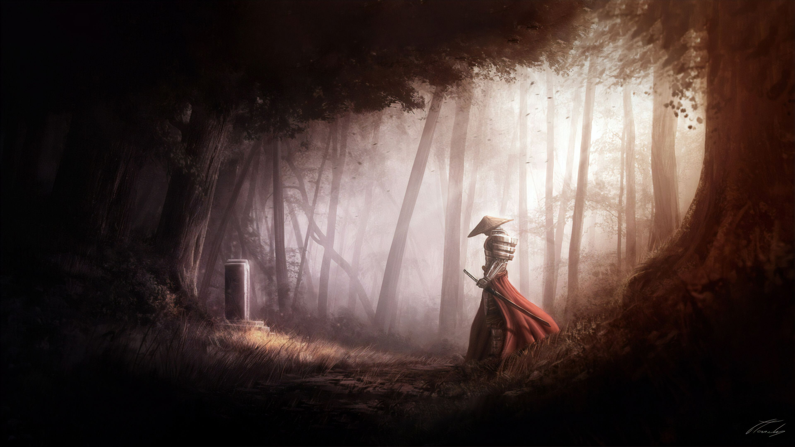

# L'Épée du Samouraï



## 1. Analyse du projet

### 1.1 Structure du projet

Le jeu "L'Épée du Samouraï" est une adaptation numérique d'un livre-jeu, développée en Java selon l'architecture MVC (Modèle-Vue-Contrôleur) :

- **Modèle** : Représente les données du jeu (chapitres, personnage, ennemis)
- **Vue** : Interface utilisateur (console ou graphique)
- **Contrôleur** : Gestion de la logique du jeu

### 1.2 Composants principaux

#### Modèle
- `Chapitre` : Représente un chapitre du livre avec son texte et ses choix
- `Personnage` : Gère les statistiques et l'inventaire du joueur
- `Enemy` : Définit les caractéristiques des ennemis
- `Scenario` : Organise l'ensemble des chapitres du jeu

#### Vue
- `SamuraiSwingUI` : Interface graphique principale avec style samouraï
- `CombatUI` : Interface de combat
- `ChapterMapUI` : Carte des chapitres montrant la progression

#### Contrôleur
- `GameController` : Gère la progression du joueur dans l'histoire
- `ScenarioLoader` : Charge les scénarios de jeu

### 1.3 Fonctionnalités implémentées

- **Navigation narrative** : Progression à travers différents chapitres
- **Système de combat** basé sur les règles du livre original
- **Gestion d'inventaire** et utilisation d'objets
- **Carte des chapitres** pour visualiser la progression
- **Système de statistiques** (habileté, endurance, etc.)
- **Sauvegarde/Chargement** de partie

### 1.4 Captures d'écran


La carte des chapitres (ci-dessus) permet aux joueurs de visualiser leur progression. Le cercle rouge indique le chapitre actuel.

## 2. Présentation du jeu

### 2.1 L'histoire

"L'Épée du Samouraï" est un jeu d'aventure textuel inspiré des livres-jeux. Vous incarnez un samouraï en quête de l'épée légendaire de votre ancêtre, connue sous le nom de "Mort Joyeuse".

Le Shogun Kihei Hasekawa vous a confié la mission de retrouver cette épée qui a été dérobée par Ikiru, le Maître des Ombres. Sans cette épée, le Shogun perd peu à peu son autorité, et des seigneurs félons commencent à se rallier à Ikiru.

Votre aventure vous conduira à travers des forêts mystérieuses, des villages abandonnés et des montagnes dangereuses, jusqu'au repaire d'Ikiru dans le Gouffre des Démons.

### 2.2 Mécaniques de jeu

- **Système de chapitres** : L'histoire se déroule à travers plusieurs chapitres avec des choix multiples
- **Combats tactiques** : Affrontez des ennemis en utilisant votre habileté et votre endurance
- **Objets et inventaire** : Collectez et utilisez des objets pour vous aider dans votre quête
- **Statistiques variables** : Vos caractéristiques évoluent selon vos choix et les combats
- **Plusieurs fins possibles** : Vos décisions influencent le déroulement et la conclusion de l'histoire

### 2.3 Interface utilisateur

Le jeu propose deux interfaces :
- Une interface textuelle pour les puristes
- Une interface graphique élaborée dans le style samouraï pour une expérience immersive

## 3. Installation et exécution

### 3.1 Prérequis

- Java Development Kit (JDK) version 21
- Un environnement capable d'exécuter des applications Java Swing

### 3.2 Installation

1. Téléchargez le code source depuis le dépôt GitHub ou utilisez la version compilée
2. Si vous utilisez le code source, assurez-vous que la structure des dossiers est préservée

### 3.3 Exécution

Pour lancer le jeu avec Java 21:

```bash
# Depuis le dossier racine du projet
java --enable-preview -jar EpeeDuSamourai.jar
```

Ou si vous exécutez depuis les fichiers source:

```bash
# Depuis le dossier racine du projet
javac --enable-preview -source 21 src/**/*.java
java --enable-preview -cp src Main
```

### 3.4 Configuration requise

- **Système d'exploitation** : Windows 10/11, macOS 10.15+, ou Linux récent
- **Processeur** : Dual Core 2GHz ou plus
- **Mémoire** : 4 Go RAM minimum
- **Espace disque** : 100 Mo disponibles
- **Affichage** : Résolution minimum de 1024x768
- **Java Runtime Environment (JRE)** : Version 21 ou ultérieure

## 4. Crédits

Ce jeu est une adaptation numérique du livre-jeu "L'Épée du Samouraï" écrit par Mark Smith et Jamie Thomson, et traduit en français par Pascale Jusforgues.

© 2025 - Développé dans le cadre d'un projet éducatif

## 5. Développement du projet

### 5.1 Prompts utilisés pour le développement avec l'IA

Le développement de ce projet a été assisté par l'IA en utilisant les prompts suivants:

1. **Architecture du projet** :
   ```
   Cree l'archi de ce projet, le nom de livre est l'épée de samouraï
   ```

2. **Interface graphique inspirée de Ghost of Tsushima** :
   ```
   add a menu when chosing the graphcal interface based of the screenshot that i gave and add both two pages, and make the game fullscreen and make the style more ghost of tsushima like samurai style you know.
   ```

3. **Animation de fond d'écran** :
   ```
   i have an animated wallpaper its a mp4 video called wandering-samurai-no-way-home-moewalls-com.mp4 in the resuorces folder and i want you to make it the background of the menu and make it loop, and change the position of the menu buttons to the right make the buttons a bit rounded add some hover effects
   ```

4. **Dialogue de sélection d'interface** :
   ```
   instead of giving the choice in the terminal you make a small popup using the same theme of the game
   ```

5. **Système de combat** :
   ```
   implement a combat system based on the photo i gave you for the ui, in the first chapter there should be a ninja garden to defeat, when defeated the game continue otherwise the lose dialog shows hime that he was defeated by the ninja, also in the photo i gave you there is an inventory button, the user can use the items, and read the readme file make the game based on that
   ```


### 5.2 Approche de développement "Vibe Coding"

Le projet a été développé en utilisant l'approche "vibe coding", qui consiste à:

1. **Conception itérative** basée sur des screenshots et références visuelles
2. **Développement orienté ambiance** pour créer une atmosphère immersive de samouraï
3. **Utilisation de prompts** pour guider le développement avec l'aide de l'IA
4. **Focus sur l'expérience utilisateur** en privilégiant le style visuel et l'ergonomie

Cette approche a permis de créer une interface cohérente avec l'univers du jeu et d'offrir une expérience utilisateur immersive dans l'esprit des jeux de samouraï comme Ghost of Tsushima.
